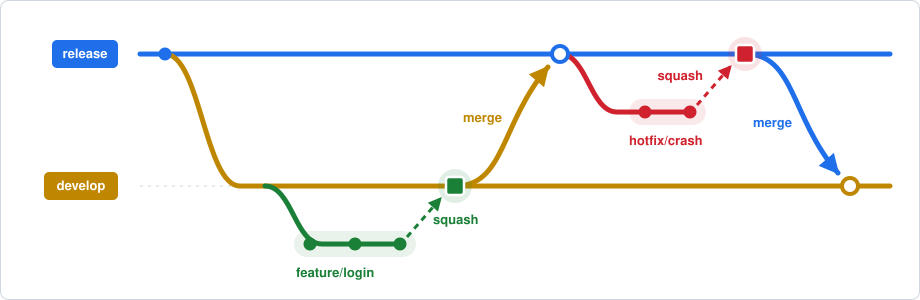
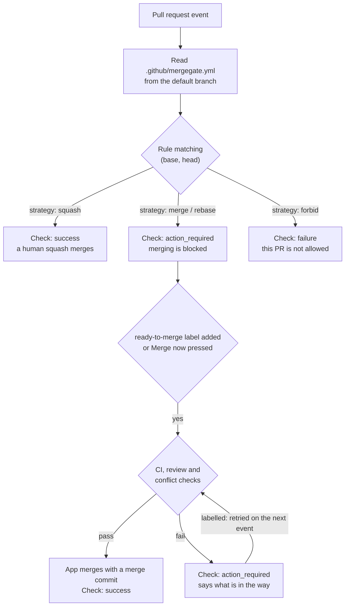
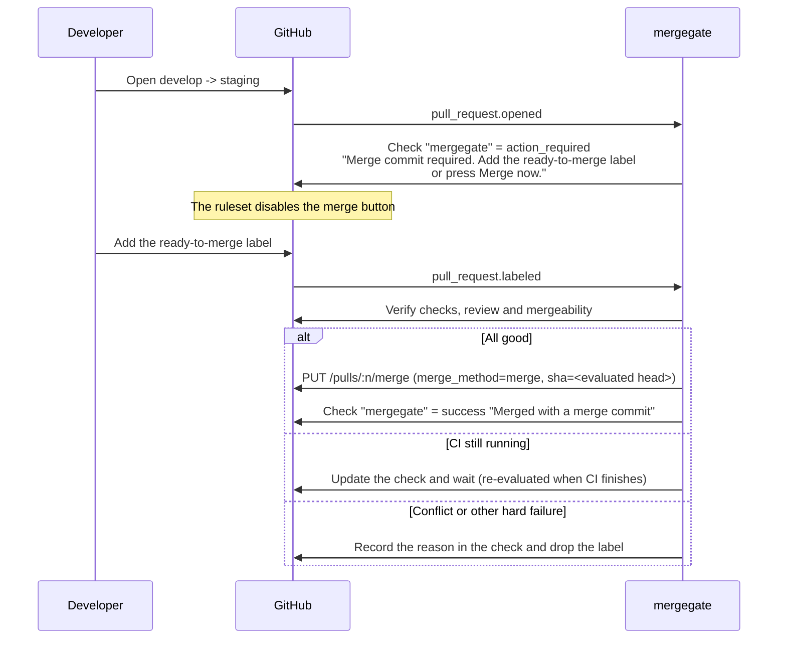

<picture>
  <source media="(prefers-color-scheme: dark)" srcset="docs/logo-dark.svg">
  
</picture>

A GitHub App that **enforces the right merge strategy per pull request** in repositories with multiple
long-lived branches.

- Squash merge is the rule. But promotion PRs such as `develop -> staging` **must be merge commits**.
- GitHub cannot express this on its own, so anyone can pick the wrong strategy from the merge button.

mergegate decides which merge strategy a PR is allowed to use from its `(base, head)` pair. PRs that
must not be squashed get a failing check, which **blocks the merge button entirely**. When such a PR is
ready, add the `ready-to-merge` label — or press **Merge now** on the check itself — and **the app merges
it for you** with the correct strategy.

---

## Table of contents

- [The problem](#the-problem)
- [How it works](#how-it-works)
- [Setup](#setup)
- [Configuration](#configuration)
- [Day-to-day usage](#day-to-day-usage)
- [Check states](#check-states)
- [Preconditions for an assisted merge](#preconditions-for-an-assisted-merge)
- [Permissions and security](#permissions-and-security)
- [Self-hosting](#self-hosting)
- [Limitations](#limitations)
- [Roadmap](#roadmap)

---

## The problem



Solid arrows are merge commits — the branches keep a shared ancestry. Dashed arrows are squash merges: the
content moves over as one new commit and the source branch's history ends there.

### What we want

In a repository with several long-lived branches — `develop` / `staging` / `production`, or `main` / `release` —
the right merge strategy depends on the kind of PR.

| PR                         | Wanted strategy | Why                                                                                            |
| -------------------------- | --------------- | ---------------------------------------------------------------------------------------------- |
| `feature/*` -> `develop`   | Squash          | Collapse the work into one readable commit                                                     |
| `develop` -> `staging`     | Merge commit    | Squashing re-introduces the same change under a new SHA, so every later promotion PR conflicts |
| `staging` -> `production`  | Merge commit    | Same as above                                                                                  |
| `hotfix/*` -> `production` | Squash          | A one-off fix is fine to collapse                                                              |

Squash a promotion PR once and the shared ancestry between the branches is broken; the diffs diverge from
then on. Merge-commit a feature PR and `develop`'s history fills up with WIP commits.
**Both are easy mistakes to make, and GitHub gives you no way to constrain a merge per pull request.**

### How far the built-in features get you

| Feature                                                                          | Granularity         | Limit                               |
| -------------------------------------------------------------------------------- | ------------------- | ----------------------------------- |
| Repository setting "Allow squash merging" and friends                            | Whole repository    | Cannot vary per branch              |
| Ruleset rule "Require a pull request before merging" > **Allowed merge methods** | **Per base branch** | Cannot condition on the head branch |

The ruleset merge method rule is powerful, and if the base branch alone determines the strategy, it is all
you need. **mergegate exists for the case where the same base needs different strategies depending on the
head branch.**

In a `main` / `release` setup, for instance:

- `feature/*` -> `main` should be squashed
- `release` -> `main` (back-merge) should be a merge commit

Both have `main` as the base, so Allowed merge methods cannot tell them apart. Nor can a ruleset **forbid a
branch pair** outright, e.g. "never open `feature/* -> production`".

> [!TIP]
> If the base branch alone determines the strategy in your workflow, you do not need this app. Use the
> ruleset's Allowed merge methods instead.

---

## How it works

mergegate receives pull request webhooks and sorts every PR into one of three buckets according to your
configuration file.



Two ideas carry the whole design.

1. **Blocking is done by the check plus a ruleset.** A PR that must not be squashed gets a failing check.
   Register that check under "Require status checks to pass" and nobody — administrators included — can
   merge it from the GitHub UI.
2. **The assisted merge is done by the app.** The app sits in the ruleset's bypass list, so it can merge past
   the check it failed itself. In exchange the app verifies the things the ruleset would have verified:
   every other check is green, the review is approved, and the branch is not in conflict.

### Timeline of a promotion PR



Labelling a PR while CI is still running is fine. The app re-evaluates on `check_suite`, `status` and
`pull_request_review` events and merges as soon as every condition holds.

### Merge now

The `mergegate` check carries a **Merge now** button in the Checks tab, so a promotion never has to leave
that screen. It merges then and there, through exactly the gates the label goes through, and **never adds
or removes a label of its own** — the label stays something you set, not something the app writes.

The two triggers therefore differ in one way, and the check run says which one you have:

|                                              | `ready-to-merge` label                    | **Merge now**             |
| -------------------------------------------- | ----------------------------------------- | ------------------------- |
| Merges when everything holds                 | Yes                                       | Yes                       |
| Still merges later, once CI or review clears | Yes — the label is a standing instruction | No — a press happens once |

So a press that cannot merge yet reports what is in the way and keeps the button, rather than promising a
merge nobody armed. Add the label instead if you want mergegate to come back on its own.

See [Merging from the Checks tab](#merging-from-the-checks-tab) for what the button itself has to satisfy,
and set `merge.allowCheckAction: false` to take it away and leave the label as the only trigger.

### Re-run

The check's **Re-run** button re-evaluates the pull request from scratch — the branch pair, the gates and
the check run output — and rewrites the check. Pressing it is always safe, and it is how you ask for a fresh
answer when a delivery was missed or a condition changed without an event of its own. **Re-run all checks**
does the same.

---

## Setup

### 1. Install the app

Install mergegate on the repository (or the whole organization). See
[Permissions and security](#permissions-and-security) for what it asks for.

### 2. Repository settings

Under Settings > General > Pull Requests, **enable every merge method you intend to use**.

- [x] Allow squash merging
- [x] Allow merge commits
- [ ] Allow rebase merging (leave off unless you use it)

> [!IMPORTANT]
> A merge method disabled in repository settings is also unavailable through the API — it returns 405.
> "Allow merge commits" must stay enabled so the app can create merge commits. Humans are constrained by
> the ruleset, not by the repository setting.

### 3. Create a ruleset

Create one ruleset targeting the base branches you want to protect (`develop`, `staging`, `production`, …).

| Setting                               | Value                                                 |
| ------------------------------------- | ----------------------------------------------------- |
| Target branches                       | `develop`, `staging`, `production` (whatever you run) |
| Require a pull request before merging | Enabled                                               |
| └ Allowed merge methods               | **Squash** only (what humans are allowed to pick)     |
| Require status checks to pass         | Enabled                                               |
| └ Required check                      | `mergegate` (select mergegate as the providing app)   |
| Bypass list                           | mergegate (mode: **Always allow**)                    |

That completes the division of labour:

- The only method a human can pick in the UI is squash — **no more accidental merge commits on feature PRs**
- Promotion PRs fail the `mergegate` check — **no more accidental squashes**
- Only the app can bypass and create the merge commit

> [!IMPORTANT]
> **"For pull requests only" does not work here.** It reads like the right mode — the app only ever merges
> pull requests — but the ruleset still refuses the merge and the app reports the API's error in the check
> run. Use "Always allow".

### 4. Add the configuration file

Add `.github/mergegate.yml` **to your default branch** (see the next section).
In a repository with no configuration file every PR is treated as `squash` — the check passes and the app
stays out of the way.

---

## Configuration

`.github/mergegate.yml` is read **from the default branch**, never from the PR head, so that a PR cannot
rewrite the rules that govern it.

A JSON Schema is published with the app, so an editor can complete the keys and flag a typo before it ever
reaches a check run. Point at it from the top of the file:

```yaml
# yaml-language-server: $schema=https://mergegate.s6n.workers.dev/mergegate.schema.json
version: 1
```

It is generated from the same schema the app validates with, so the two cannot drift apart. What it cannot
express are the two rules that relate one key to another: `includeTransitive` needs a head that names a
branch rather than only a pattern, and `includeReversed` needs a head other than the catch-all. The app
checks both and reports them in the check run.

### Example: develop / staging / production

```yaml
version: 1

rules:
  # Promotion PRs use merge commits. includeTransitive also catches a promotion
  # opened from an intermediate branch after a conflict; see below.
  - base: staging
    head: develop
    includeTransitive: true
    strategy: merge

  - base: production
    head: staging
    includeTransitive: true
    strategy: merge

  # Emergency fixes may go in directly, squashed
  - base: production
    head: hotfix/*
    strategy: squash

  # Nothing else may target production
  - base: production
    strategy: forbid

  # Everything else (feature/* -> develop and friends) is squashed
  - base: "**"
    strategy: squash
```

### Example: main / release

```yaml
version: 1

rules:
  # main and release promote into each other, so one rule covers both
  # directions: main -> release and the back merge release -> main.
  - base: release
    head: main
    includeReversed: true
    strategy: merge

  - base: release
    head: hotfix/*
    strategy: squash

  - base: "**"
    strategy: squash
```

Note how `base: main` resolves differently depending on the head branch — the part a ruleset cannot express.

### Promotions that conflict

When a promotion conflicts, the fix is usually a branch off the base with the source merged into it, so the
conflicts are resolved and reviewed there rather than on either long-lived branch:

```console
$ git switch -c merge/develop-to-staging staging
$ git merge develop      # resolve the conflicts here
$ git push -u origin merge/develop-to-staging
```

That pull request's head is `merge/develop-to-staging`, not `develop`, so it would miss the promotion rule
and be treated as an ordinary feature branch — squashed, flattening the very merge commit that resolves the
conflict. There are two ways to catch it.

#### By what the pull request carries

`includeTransitive: true` matches the rule against any branch that brings commits from `develop` which
`staging` does not already have, whatever that branch is called:

```yaml
- base: staging
  head: develop
  includeTransitive: true
  strategy: merge
```

This asks the history instead of trusting a naming convention, so a branch named `wip`, `fix-conflicts` or
anything else is caught just the same, and the answer does not change when someone pushes to `develop` while
the pull request is open. The head branch of the rule has to name a branch (`develop`), not only a pattern —
there is no history to follow from `release/*`.

One consequence worth knowing: a feature branch cut from `develop` and pointed at `staging` also carries
develop's commits, so it matches too. That is the honest answer rather than an accident — merging it does
bring develop's history into staging, and squashing it would flatten exactly the same thing.

#### By name

`head` also takes a list of patterns, and a rule matches when any of them matches:

```yaml
- base: staging
  head: [develop, "merge/develop-*"]
  strategy: merge
```

No API calls, but only as reliable as the convention: a branch named something else falls through to
`defaults.strategy` — the direction that squashes a promotion. Naming the pattern per promotion
(`merge/develop-*` rather than `merge/*`) at least keeps an intermediate branch from reaching a rule it was
not meant for.

Either way the guard rails hold: a `forbid` rule still refuses what no rule matches, and a fork head still
cannot reach an assisted rule — by name or by what it carries.

### Back merges

Two long-lived branches that promote into each other need the same treatment in both directions, and
writing the pair twice is how the two halves drift apart. `includeReversed: true` applies the rule to the
back merge as well — the same `(base, head)` with the two swapped:

```yaml
- base: staging
  head: develop
  includeReversed: true
  strategy: merge
```

That one rule answers for `staging <- develop` and for `develop <- staging`. Only those two: a pull request
into `develop` from anywhere else, and one from `staging` into a branch the rule never named, are untouched.
With a list of heads, every one of them is a base in the reversed direction, so
`head: [develop, "release/*"]` also covers `develop <- staging` and `release/2026-08 <- staging`.

It composes with `includeTransitive`, which is what a back merge that conflicts needs — the intermediate
branch is off `develop` with `staging` merged into it, so it carries `staging` rather than naming it:

```yaml
- base: staging
  head: develop
  includeTransitive: true
  includeReversed: true
  strategy: merge
```

Between them the four cases are covered: the promotion, the promotion through an intermediate branch, the
back merge, and the back merge through one.

A rule with no `head` of its own cannot be reversed. `head` defaults to `**`, and reversing that would
quietly match every pull request out of the base, which is never what writing one rule for a pair of
branches meant; the app rejects it rather than guessing.

### Reference

```yaml
version: 1 # Required. Only 1 for now

defaults:
  strategy: squash # Strategy for PRs that match no rule

check:
  name: mergegate # Check run name. Must match what you register in the ruleset

merge:
  label: ready-to-merge # Label that triggers an assisted merge
  manual: [squash] # Strategies a human may merge from the UI. Keep in sync with Allowed merge methods
  requireApproval: true # The review must be approved (or not required)
  requireChecks: true # Every check other than mergegate must have succeeded
  requireUpToDate: false # The head must be up to date with the base
  allowForkHead: false # Whether PRs from forks may match non-squash rules
  allowCheckAction: true # Offer a "Merge now" button on the check run
  deleteBranchOnMerge: false # Delete the head branch after merging
  removeLabelOnFailure: true # Drop the label on a permanent failure so re-adding retries
  commitTitle: "Merge {head} into {base} (#{number})"
  commitMessage: "" # Empty means GitHub's default

rules:
  - base: staging # Required. Pattern for the base branch
    head: develop # A pattern, or a list of them. Defaults to "**"
    strategy: merge # squash | merge | rebase | forbid
    includeTransitive: false # Also match branches carrying commits from head
    includeReversed: false # Also apply the rule to the back merge (base and head swapped)
```

#### How rules are evaluated

- **Rules are evaluated top to bottom and the first match wins.** Put specific rules first.
- If nothing matches, `defaults.strategy` applies.
- Patterns are globs: `*` matches any run of characters except `/`, `**` matches any run including `/`.
- `head` takes one pattern or a list of them; a rule matches when any of them matches. With
  `includeTransitive: true` it also matches a branch carrying commits from one of them. See
  [Promotions that conflict](#promotions-that-conflict).
- `includeReversed: true` applies the rule to the back merge as well, so a pair of branches that promote
  into each other is one rule rather than two. See [Back merges](#back-merges). It needs a `head` of its
  own — the default `**` cannot be reversed.
- `head` is matched against the branch name (`head.ref`). While `merge.allowForkHead` is `false`, PRs from
  forks never match a non-`squash` rule, so nobody can get promotion treatment by naming a branch `develop`
  in their fork.

#### What each strategy means

| strategy | Check                                       | Merged by                          |
| -------- | ------------------------------------------- | ---------------------------------- |
| `squash` | success                                     | A human, via "Squash and merge"    |
| `merge`  | action_required, then success once labelled | mergegate (`merge_method: merge`)  |
| `rebase` | action_required, then success once labelled | mergegate (`merge_method: rebase`) |
| `forbid` | failure (permanent)                         | Nobody                             |

A strategy listed in `merge.manual` means "a human merges this"; anything else means "the app merges this".
The default is `[squash]`. If merge commits are your primary strategy, set `manual: [merge]` instead.

---

## Day-to-day usage

### An ordinary feature PR

Nothing changes. The `mergegate` check goes green and you press "Squash and merge". The ruleset makes sure
merge commit and rebase are not even offered.

### A promotion PR (`develop -> staging` and similar)

1. Open the PR. The `mergegate` check reports **Action required** and the merge button is disabled.
2. The check details explain that this PR will be merged with a merge commit once you add the
   `ready-to-merge` label, and carry a **Merge now** button for merging it on the spot.
3. Add the `ready-to-merge` label. If CI is still running, that is fine: the label stands, and mergegate
   merges once CI finishes.
4. Or, once everything is already green, press **Merge now** on the check in the Checks tab and it merges
   straight away without leaving that screen.

**Changed your mind?** Remove the label. As long as the merge has not started, it is cancelled. There is
nothing to cancel after a press of **Merge now**: it either merged or it told you why it could not.

### A forbidden branch pair

A PR matching `strategy: forbid` gets a **failure** check with no way to clear it. Retarget the PR to the
right base branch — changing the base triggers a fresh evaluation — or close it.

---

## Check states

| Situation                                          | conclusion        | title                                                   |
| -------------------------------------------------- | ----------------- | ------------------------------------------------------- |
| PR that should be squashed                         | `success`         | `Squash merge`                                          |
| Assisted merge, not labelled yet                   | `action_required` | `Merge commit required`                                 |
| Labelled, waiting on CI                            | `action_required` | `Waiting for other checks`                              |
| Labelled, waiting on review                        | `action_required` | `Waiting for review approval`                           |
| Labelled, conflicting                              | `action_required` | `Cannot merge: conflicts with base`                     |
| Labelled, changes requested                        | `action_required` | `Cannot merge: changes requested`                       |
| Labelled, still a draft                            | `action_required` | `Waiting for the pull request to be ready`              |
| Labelled, mergeability not computed yet            | `action_required` | `Waiting for GitHub to compute mergeability`            |
| Labelled, more checks than mergegate reads         | `action_required` | `Cannot read every check on this commit`                |
| Labelled, behind the base (with `requireUpToDate`) | `action_required` | `Waiting for the branch to be up to date`               |
| Labelled, the merge API refused                    | `action_required` | `Cannot merge`                                          |
| Assisted merge succeeded                           | `success`         | `Merged by mergegate`                                   |
| Forbidden branch pair                              | `failure`         | `Pull requests into <base> from <head> are not allowed` |
| Broken configuration                               | `failure`         | `Invalid .github/mergegate.yml`                         |

The first row's title names whichever strategy `merge.manual` lists, so a repository whose humans merge with
merge commits sees `Merge commit` there instead.

The `Labelled` rows read the same way after a **Merge now** press, with one difference the summary spells
out: a labelled pull request is one mergegate comes back to, an unlabelled one is not. So the button stays
wherever nothing is going to happen by itself, and is absent wherever mergegate is already going to act.

Both `action_required` and `failure` count as failing for a required status check, so either blocks the
merge. The check is flipped to `success` after an assisted merge so that merged PRs do not carry a red X in
their history.

> [!NOTE]
> mergegate is **fail-closed**: a PR it cannot make a decision about stays blocked. If the app is down, the
> required check is never reported and merges are blocked as well.

---

## Preconditions for an assisted merge

Even with the `ready-to-merge` label present, the app merges only once all of the following hold.

- The PR is open and not a draft
- `mergeable` is true (no conflict with the base). GitHub computes this asynchronously, so a freshly
  labelled PR often has no answer yet; mergegate waits a few seconds rather than leaving it blocked until
  some other event wakes it. If it still has not settled, the check says so and the label can be re-added —
  or **Merge now** pressed again
- With `merge.requireChecks: true`, every check run and commit status other than `mergegate` is success,
  neutral or skipped
- With `merge.requireApproval: true`, `reviewDecision` is `APPROVED` or reviews are not required (`null`).
  `CHANGES_REQUESTED` is always refused
- With `merge.requireUpToDate: true`, the head is up to date with the base

The merge call carries **the head SHA that was evaluated**. If a new commit is pushed in between, GitHub
returns 409, and mergegate aborts and re-evaluates — an unreviewed commit never sneaks into a merge.

### Merging from the Checks tab

**Merge now** goes through every gate above, and two more that belong to the button itself.

- **Whoever pressed it must be able to push to the repository.** Pressing a button in a browser carries no
  permission of its own, so mergegate asks GitHub for that user's permission level and refuses anything
  below write. That is what stands in for "labelling requires write access". If the answer cannot be read,
  the press is refused and the label stays the way in.
- **The button belongs to the commit it was rendered on.** If the head moved between the check run and the
  press, mergegate ignores the press and only re-evaluates the pull request; the new commit gets a button
  of its own. The press also names a commit rather than a pull request, so on the rare commit that heads
  two open PRs nothing is merged — use the label there.

A press that clears all of it merges immediately. A press that does not writes the reason into the check and
stops there, leaving the button for when the reason is gone — it never adds the label on your behalf, so
nothing about the pull request changes behind your back.

### When it fails

- **Transient failures** (CI still running, the base moved) leave the check updated and the app retries on
  the next event.
- **Permanent failures** (conflict, missing permission, merge method disabled in repository settings) are
  written into the check, and with `merge.removeLabelOnFailure: true` the label is dropped. Fix the cause and
  re-add the label to retry. A merge asked for with **Merge now** had no label in the first place, so the
  check keeps the button instead.

---

## Permissions and security

### Repository permissions

| Permission    | Level        | Used for                                            |
| ------------- | ------------ | --------------------------------------------------- |
| Metadata      | Read         | Mandatory. Also the permission behind `Merge now`   |
| Checks        | Read & write | Creating and updating check runs                    |
| Contents      | Read & write | Reading the config file, merging                    |
| Pull requests | Read & write | Reading PRs, merging, dropping the label on failure |

### Webhook events

`pull_request`, `pull_request_review`, `check_suite`, `check_run`, `status`, `push`, `installation`

`check_run` carries the **Re-run** and **Merge now** presses as well as other apps' results, and GitHub only
sends the first two to apps with **Checks: read & write** — which the table above already asks for.

### Guarantees by design

- **Configuration is read from the default branch only.** Editing `.github/mergegate.yml` on a PR branch
  has no effect on that PR.
- **Signatures are verified.** `X-Hub-Signature-256` is checked with HMAC-SHA256 using a constant-time
  comparison; anything else is rejected with 401.
- **Both triggers require write access.** Labelling rides on GitHub's own permission model, and a
  **Merge now** press is checked against GitHub's permission API before it is honoured. See
  [Merging from the Checks tab](#merging-from-the-checks-tab); `merge.allowCheckAction: false` removes the
  button altogether.
- **No state is owned by the app.** Everything needed for a decision comes from the GitHub API. The only
  things persisted are a config cache and delivery-ID deduplication, and losing either is harmless.

---

## Self-hosting

mergegate targets Cloudflare Workers, but its core is **runtime-agnostic**: everything runtime-specific sits
behind four ports, implemented under `src/adapters/`, so another runtime is an adapter rather than a fork.

### Cloudflare Workers

```console
$ vp install
$ wrangler secret put GITHUB_APP_ID
$ wrangler secret put GITHUB_APP_PRIVATE_KEY
$ wrangler secret put GITHUB_WEBHOOK_SECRET
$ wrangler deploy
```

The webhook URL is `https://<your-worker>/webhooks/github`. Health check: `GET /health`, which also
validates the secrets: a 500 there names what is wrong with them (a PKCS#1 key, a mangled PEM, an app
slug where the numeric id belongs) instead of failing later on the first API call.

`GET /mergegate.schema.json` serves the configuration schema, so a repository can point its editor at the
deployment it actually talks to.

> [!IMPORTANT]
> GitHub hands you a PKCS#1 private key, but WebCrypto wants PKCS#8. Convert it first:
>
> ```console
> $ openssl pkcs8 -topk8 -inform PEM -outform PEM -nocrypt -in app.private-key.pem -out app.pkcs8.pem
> ```

---

## Limitations

- **Preventing a wrong merge on a squash PR relies on the ruleset.** If the check is green, the app cannot
  stop a human from choosing "Create a merge commit". Always configure Allowed merge methods.
- **Not compatible with merge queues.** A merge queue picks the merge method itself and conflicts with the
  assisted merge.
- **PRs from forks** are always treated as squash candidates by default.

## Roadmap

- Per-PR event serialization with Durable Objects
- GitHub Enterprise Server support

## License

MIT
