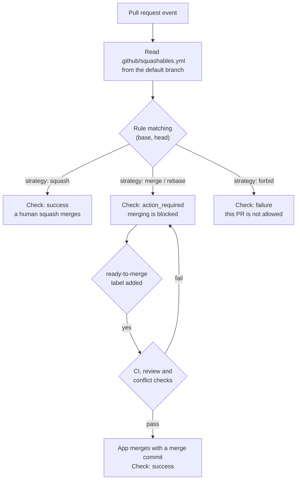
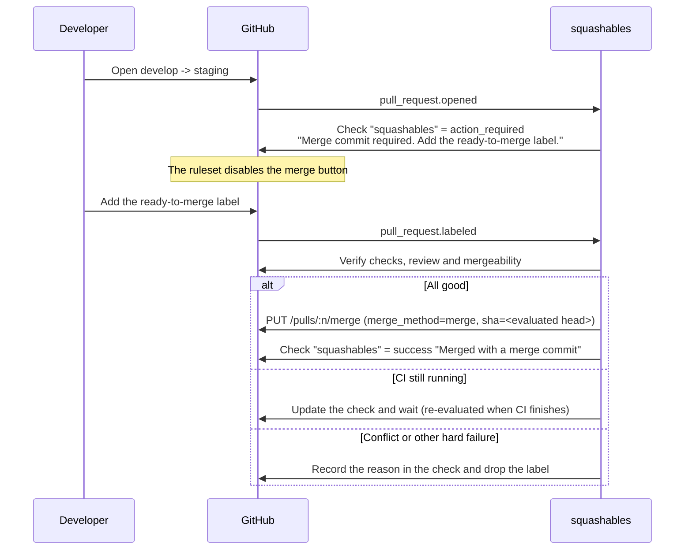

# squashables

A GitHub App that **enforces the right merge strategy per pull request** in repositories with multiple
long-lived branches.

- Squash merge is the rule. But promotion PRs such as `develop -> staging` **must be merge commits**.
- GitHub cannot express this on its own, so anyone can pick the wrong strategy from the merge button.

squashables decides which merge strategy a PR is allowed to use from its `(base, head)` pair. PRs that
must not be squashed get a failing check, which **blocks the merge button entirely**. When such a PR is
ready, add the `ready-to-merge` label and **the app merges it for you** with the correct strategy.

---

## Table of contents

- [The problem](#the-problem)
- [How it works](#how-it-works)
- [Setup](#setup)
- [Configuration](#configuration)
- [Day-to-day usage](#day-to-day-usage)
- [Check states](#check-states)
- [Preconditions for an assisted merge](#preconditions-for-an-assisted-merge)
- [Permissions and security](#permissions-and-security)
- [Self-hosting](#self-hosting)
- [Limitations](#limitations)
- [Roadmap](#roadmap)

---

## The problem

### What we want

In a repository with several long-lived branches — `develop` / `staging` / `production`, or `main` / `release` —
the right merge strategy depends on the kind of PR.

| PR | Wanted strategy | Why |
| --- | --- | --- |
| `feature/*` -> `develop` | Squash | Collapse the work into one readable commit |
| `develop` -> `staging` | Merge commit | Squashing re-introduces the same change under a new SHA, so every later promotion PR conflicts |
| `staging` -> `production` | Merge commit | Same as above |
| `hotfix/*` -> `production` | Squash | A one-off fix is fine to collapse |

Squash a promotion PR once and the shared ancestry between the branches is broken; the diffs diverge from
then on. Merge-commit a feature PR and `develop`'s history fills up with WIP commits.
**Both are easy mistakes to make, and GitHub gives you no way to constrain a merge per pull request.**

### How far the built-in features get you

| Feature | Granularity | Limit |
| --- | --- | --- |
| Repository setting "Allow squash merging" and friends | Whole repository | Cannot vary per branch |
| Ruleset rule "Require a pull request before merging" > **Allowed merge methods** | **Per base branch** | Cannot condition on the head branch |

The ruleset merge method rule is powerful, and if the base branch alone determines the strategy, it is all
you need. **squashables exists for the case where the same base needs different strategies depending on the
head branch.**

In a `main` / `release` setup, for instance:

- `feature/*` -> `main` should be squashed
- `release` -> `main` (back-merge) should be a merge commit

Both have `main` as the base, so Allowed merge methods cannot tell them apart. Nor can a ruleset **forbid a
branch pair** outright, e.g. "never open `feature/* -> production`".

> [!TIP]
> If the base branch alone determines the strategy in your workflow, you do not need this app. Use the
> ruleset's Allowed merge methods instead.

---

## How it works

squashables receives pull request webhooks and sorts every PR into one of three buckets according to your
configuration file.



Two ideas carry the whole design.

1. **Blocking is done by the check plus a ruleset.** A PR that must not be squashed gets a failing check.
   Register that check under "Require status checks to pass" and nobody — administrators included — can
   merge it from the GitHub UI.
2. **The assisted merge is done by the app.** The app sits in the ruleset's bypass list, so it can merge past
   the check it failed itself. In exchange the app verifies the things the ruleset would have verified:
   every other check is green, the review is approved, and the branch is not in conflict.

### Timeline of a promotion PR



Labelling a PR while CI is still running is fine. The app re-evaluates on `check_suite`, `status` and
`pull_request_review` events and merges as soon as every condition holds.

---

## Setup

### 1. Install the app

Install squashables on the repository (or the whole organization). See
[Permissions and security](#permissions-and-security) for what it asks for.

### 2. Repository settings

Under Settings > General > Pull Requests, **enable every merge method you intend to use**.

- [x] Allow squash merging
- [x] Allow merge commits
- [ ] Allow rebase merging (leave off unless you use it)

> [!IMPORTANT]
> A merge method disabled in repository settings is also unavailable through the API — it returns 405.
> "Allow merge commits" must stay enabled so the app can create merge commits. Humans are constrained by
> the ruleset, not by the repository setting.

### 3. Create a ruleset

Create one ruleset targeting the base branches you want to protect (`develop`, `staging`, `production`, …).

| Setting | Value |
| --- | --- |
| Target branches | `develop`, `staging`, `production` (whatever you run) |
| Require a pull request before merging | Enabled |
| └ Allowed merge methods | **Squash** only (what humans are allowed to pick) |
| Require status checks to pass | Enabled |
| └ Required check | `squashables` (select squashables as the providing app) |
| Bypass list | squashables (mode: **For pull requests only**) |

That completes the division of labour:

- The only method a human can pick in the UI is squash — **no more accidental merge commits on feature PRs**
- Promotion PRs fail the `squashables` check — **no more accidental squashes**
- Only the app can bypass and create the merge commit

> [!NOTE]
> "For pull requests only" is enough. The app never pushes to a protected branch outside of merging a PR.
> Switch to "Always allow" only if merges are rejected in your setup.

### 4. Add the configuration file

Add `.github/squashables.yml` **to your default branch** (see the next section).
In a repository with no configuration file every PR is treated as `squash` — the check passes and the app
stays out of the way.

---

## Configuration

`.github/squashables.yml` is read **from the default branch**, never from the PR head, so that a PR cannot
rewrite the rules that govern it.

### Example: develop / staging / production

```yaml
version: 1

rules:
  # Promotion PRs use merge commits
  - base: staging
    head: develop
    strategy: merge

  - base: production
    head: staging
    strategy: merge

  # Emergency fixes may go in directly, squashed
  - base: production
    head: hotfix/*
    strategy: squash

  # Nothing else may target production
  - base: production
    strategy: forbid

  # Everything else (feature/* -> develop and friends) is squashed
  - base: "**"
    strategy: squash
```

### Example: main / release

```yaml
version: 1

rules:
  - base: release
    head: main
    strategy: merge

  # The back-merge from release is a merge commit too
  - base: main
    head: release
    strategy: merge

  - base: release
    head: hotfix/*
    strategy: squash

  - base: "**"
    strategy: squash
```

Note how `base: main` resolves differently depending on the head branch — the part a ruleset cannot express.

### Reference

```yaml
version: 1                    # Required. Only 1 for now

defaults:
  strategy: squash            # Strategy for PRs that match no rule

check:
  name: squashables           # Check run name. Must match what you register in the ruleset

merge:
  label: ready-to-merge       # Label that triggers an assisted merge
  manual: [squash]            # Strategies a human may merge from the UI. Keep in sync with Allowed merge methods
  requireApproval: true       # The review must be approved (or not required)
  requireChecks: true         # Every check other than squashables must have succeeded
  requireUpToDate: false      # The head must be up to date with the base
  allowForkHead: false        # Whether PRs from forks may match non-squash rules
  deleteBranchOnMerge: false  # Delete the head branch after merging
  removeLabelOnFailure: true  # Drop the label on a permanent failure so re-adding retries
  commitTitle: "Merge {head} into {base} (#{number})"
  commitMessage: ""           # Empty means GitHub's default

rules:
  - base: staging             # Required. Pattern for the base branch
    head: develop             # Defaults to "**"
    strategy: merge           # squash | merge | rebase | forbid
```

#### How rules are evaluated

- **Rules are evaluated top to bottom and the first match wins.** Put specific rules first.
- If nothing matches, `defaults.strategy` applies.
- Patterns are globs: `*` matches any run of characters except `/`, `**` matches any run including `/`.
- `head` is matched against the branch name (`head.ref`). While `merge.allowForkHead` is `false`, PRs from
  forks never match a non-`squash` rule, so nobody can get promotion treatment by naming a branch `develop`
  in their fork.

#### What each strategy means

| strategy | Check | Merged by |
| --- | --- | --- |
| `squash` | success | A human, via "Squash and merge" |
| `merge` | action_required, then success once labelled | squashables (`merge_method: merge`) |
| `rebase` | action_required, then success once labelled | squashables (`merge_method: rebase`) |
| `forbid` | failure (permanent) | Nobody |

A strategy listed in `merge.manual` means "a human merges this"; anything else means "the app merges this".
The default is `[squash]`. If merge commits are your primary strategy, set `manual: [merge]` instead.

---

## Day-to-day usage

### An ordinary feature PR

Nothing changes. The `squashables` check goes green and you press "Squash and merge". The ruleset makes sure
merge commit and rebase are not even offered.

### A promotion PR (`develop -> staging` and similar)

1. Open the PR. The `squashables` check reports **Action required** and the merge button is disabled.
2. The check details explain that this PR will be merged with a merge commit once you add the
   `ready-to-merge` label.
3. When review and CI are done, add the `ready-to-merge` label.
4. squashables merges it with a merge commit. If CI is still running when you label it, the app waits and
   merges once CI finishes.

**Changed your mind?** Remove the label. As long as the merge has not started, it is cancelled.

### A forbidden branch pair

A PR matching `strategy: forbid` gets a **failure** check with no way to clear it. Retarget the PR to the
right base branch — changing the base triggers a fresh evaluation — or close it.

---

## Check states

| Situation | conclusion | title |
| --- | --- | --- |
| PR that should be squashed | `success` | `Squash merge` |
| Assisted merge, not labelled yet | `action_required` | `Merge commit required` |
| Labelled, waiting on CI | `action_required` | `Waiting for other checks` |
| Labelled, waiting on review | `action_required` | `Waiting for review approval` |
| Labelled, conflicting | `action_required` | `Cannot merge: conflicts with base` |
| Assisted merge succeeded | `success` | `Merged by squashables` |
| Forbidden branch pair | `failure` | `Pull requests into <base> from <head> are not allowed` |
| Broken configuration | `failure` | `Invalid .github/squashables.yml` |

Both `action_required` and `failure` count as failing for a required status check, so either blocks the
merge. The check is flipped to `success` after an assisted merge so that merged PRs do not carry a red X in
their history.

> [!NOTE]
> squashables is **fail-closed**: a PR it cannot make a decision about stays blocked. If the app is down, the
> required check is never reported and merges are blocked as well.

---

## Preconditions for an assisted merge

Even with the `ready-to-merge` label present, the app merges only once all of the following hold.

- The PR is open and not a draft
- `mergeable` is true (no conflict with the base)
- With `merge.requireChecks: true`, every check run and commit status other than `squashables` is
  success, neutral or skipped
- With `merge.requireApproval: true`, `reviewDecision` is `APPROVED` or reviews are not required (`null`).
  `CHANGES_REQUESTED` is always refused
- With `merge.requireUpToDate: true`, the head is up to date with the base

The merge call carries **the head SHA that was evaluated**. If a new commit is pushed in between, GitHub
returns 409, and squashables aborts and re-evaluates — an unreviewed commit never sneaks into a merge.

### When it fails

- **Transient failures** (CI still running, the base moved) leave the check updated and the app retries on
  the next event.
- **Permanent failures** (conflict, missing permission, merge method disabled in repository settings) are
  written into the check, and with `merge.removeLabelOnFailure: true` the label is dropped. Fix the cause and
  re-add the label to retry.

---

## Permissions and security

### Repository permissions

| Permission | Level | Used for |
| --- | --- | --- |
| Metadata | Read | Mandatory |
| Checks | Read & write | Creating and updating check runs |
| Contents | Read & write | Reading the config file, merging |
| Pull requests | Read & write | Reading PRs, merging, label handling |

### Webhook events

`pull_request`, `pull_request_review`, `check_suite`, `check_run`, `status`, `push`, `installation`

### Guarantees by design

- **Configuration is read from the default branch only.** Editing `.github/squashables.yml` on a PR branch
  has no effect on that PR.
- **Signatures are verified.** `X-Hub-Signature-256` is checked with HMAC-SHA256 using a constant-time
  comparison; anything else is rejected with 401.
- **Labelling requires write access**, so the trigger for an assisted merge rides on GitHub's own permission
  model.
- **The app ignores its own events.** `check_run` events for check runs squashables created are dropped, so
  it cannot loop.
- **Bypass is kept narrow.** "For pull requests only" is the recommended mode. Bypassing is the price of this
  design, which is exactly why the app re-verifies CI and review itself.
- **No state is owned by the app.** Everything needed for a decision comes from the GitHub API. The only
  things persisted are a config cache and delivery-ID deduplication, and losing either is harmless.

---

## Self-hosting

squashables targets Cloudflare Workers, but its core is **runtime-agnostic**.

```
src/
  core/        Pure logic (policy, config, event handling) on web standard APIs only
  adapters/
    github/      GitHub API client
    cloudflare/  Workers entry point (default)
    node/        Node.js entry point
```

### Cloudflare Workers

```console
$ vp install
$ wrangler secret put GITHUB_APP_ID
$ wrangler secret put GITHUB_APP_PRIVATE_KEY
$ wrangler secret put GITHUB_WEBHOOK_SECRET
$ wrangler deploy
```

The webhook URL is `https://<your-worker>/webhooks/github`. Health check: `GET /health`.

> [!IMPORTANT]
> GitHub hands you a PKCS#1 private key, but WebCrypto wants PKCS#8. Convert it first:
>
> ```console
> $ openssl pkcs8 -topk8 -inform PEM -outform PEM -nocrypt -in app.private-key.pem -out app.pkcs8.pem
> ```

### Porting to another runtime

The core needs nothing but these ports. Implement them and it runs anywhere.

| Port | Responsibility | Cloudflare implementation |
| --- | --- | --- |
| `Env` | Secrets and settings | Worker `env` bindings |
| `Deferrer` | Work that continues after the response | `ctx.waitUntil` |
| `Cache` | Config cache and deduplication (optional) | Workers KV |
| `Logger` | Structured logging | `console` (JSON) |
| `Clock` | Current time | `Date` |

The entry point is a plain `(request: Request) => Promise<Response>`. On Node.js, a thin `node:http` adapter
is all it takes.

---

## Limitations

- **Preventing a wrong merge on a squash PR relies on the ruleset.** If the check is green, the app cannot
  stop a human from choosing "Create a merge commit". Always configure Allowed merge methods.
- **Not compatible with merge queues.** A merge queue picks the merge method itself and conflicts with the
  assisted merge.
- **If the app is down, merges stop**, because the required check is never reported (fail-closed).
- **PRs from forks** are always treated as squash candidates by default.

## Roadmap

- Check run requested actions (merge from the Checks tab instead of adding a label)
- Opt-in PR comments explaining the decision
- Organization-wide defaults inherited from the `.github` repository
- Per-PR event serialization with Durable Objects
- GitHub Enterprise Server support

## License

MIT
